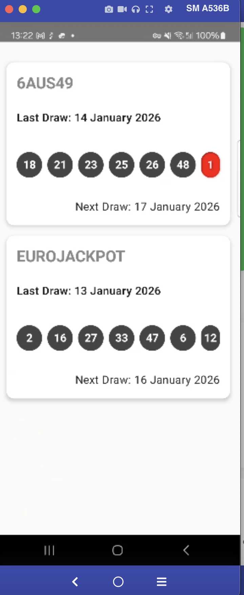
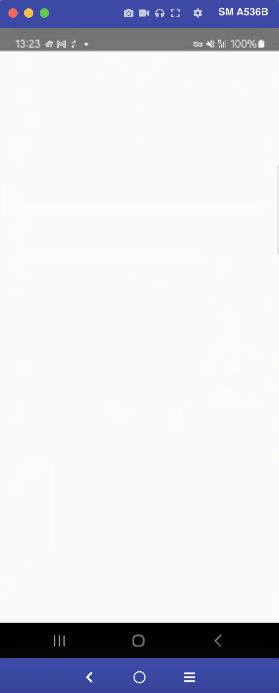
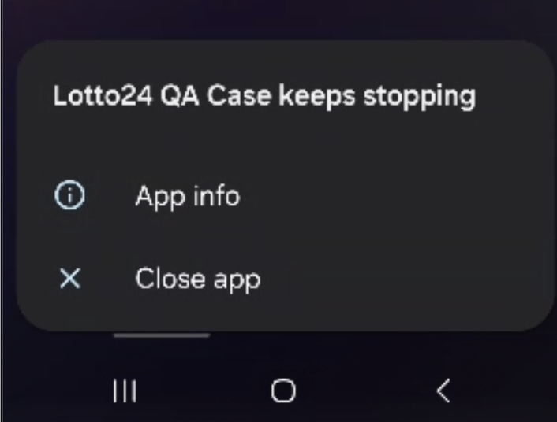
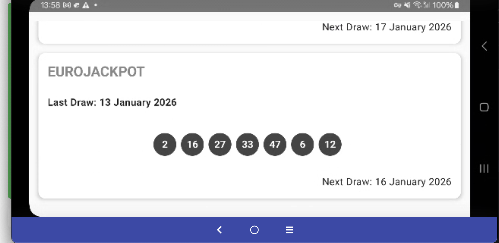
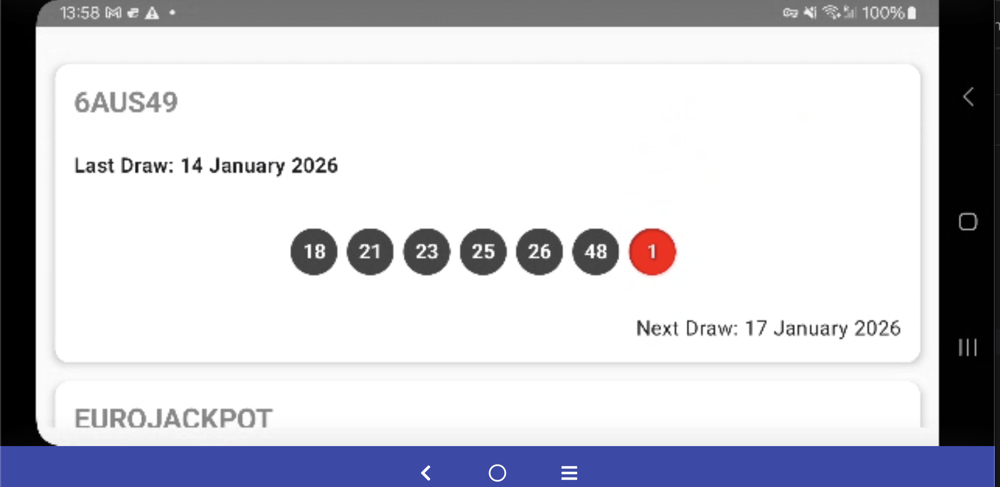
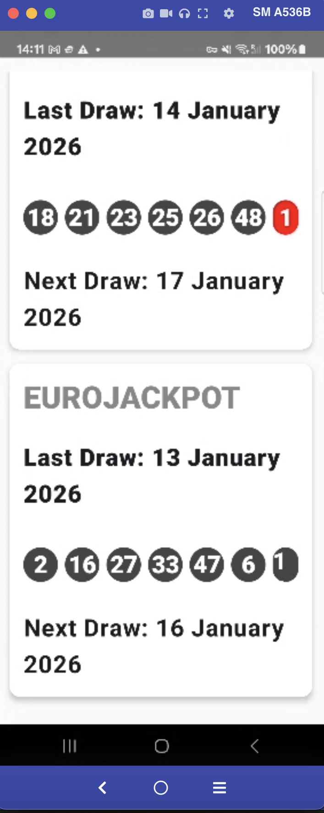
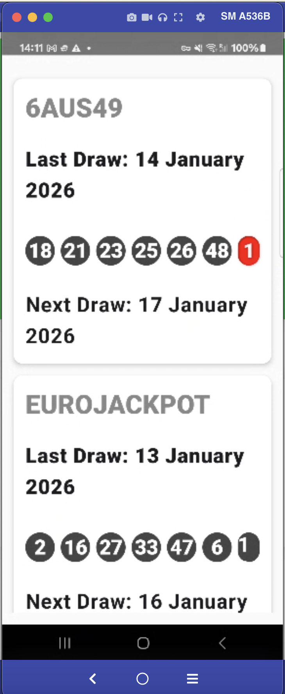

## Task 2 -  General QA and Bug Reporting

**Selected Critical Bug for Task 2: BUG3 - Crash on offline launch**

## BUG1
## Summary
Android - 6AUS49 & EuroJackpot - UI: Rightmost number bubble is clipped on Lotto cards

## Preconditions
- App is launched successfully
- User is on the main screen where lottery result cards are displayed

## Steps to Reproduce
1. Launch the app.
2. observe the 6AUS49 card on the main screen.
3. verify the numbers row and look at the last circle on the right side (super number).
4. scroll down and observe the EUROJACKPOT card.
5. verify the numbers row and look at the last circle on the right side.

## Expected Result
All number circles (including the last one on the right) should be fully visible inside the card
without being cut off or clipped.

## Actual Result
The rightmost number circle is partially clipped/cut off on the right side:
6AUS49: the super number circle (e.g., "1", red circle) is clipped.
EUROJACKPOT: the last number circle (e.g., "12") is clipped.

## Severity
Medium

## Priority
High :P2

## Environment
- Device: Samsung Galaxy A53 5G (SM-A536B)
- OS: Android 14
- Build variant: Debug
- App: Lotto24 QA Case (local build from repository)
- Network: Wi-Fi

## BUG2
## Summary
Android - UI: Dark mode is ignored

## Preconditions
- App is launched successfully
- User is on the main screen where lottery result cards are displayed

## Steps to Reproduce
1. on the Android device , open **Settings**.
2. go to **Display**.
3. Enable **Dark mode**.
4. Verify the system UI is now in dark theme.
5. Launch the **Lotto24 QA Case** app.
6. Observe the app UI background and overall theme.
7. Close the app completely (remove from Recent Apps) and open it again.
8. Observe that the UI still remains in Light theme.

## Expected result :
the app UI should switch to the **dark theme**
(e.g., dark background and appropriate contrast for
text and UI elements).

## Actual result :
The app UI remains in **light theme** even 
though Dark Mode is enabled

## Severity
Medium (UX / Accessibility issue)

## Priority
High :P2 (Affects many users and is easy to notice)

## Environment
- Device: Samsung Galaxy A53 5G (SM-A536B)
- OS: Android 14
- Build variant: Debug
- App: Lotto24 QA Case (local build from repository)
- Network: Wi-Fi

## BUG3
## Summary
Android - App crashes on launch when device is offline

## Preconditions
- App is launched successfully
- User is on the main screen where lottery result cards are displayed

## Steps to Reproduce
1. enable Airplane Mode (or disable both Wi-Fi and Mobile Data)
2. fully close the app (remove it from recent apps)
3. launch the app
4. wait a few seconds on the blank screen

## Expected Result

The app should handle offline state gracefully by showing:
“No internet connection” message and the app should not crash.

## Actual Result

The app shows a blank white screen, then after a few seconds it crashes and Android displays:
“Lotto24 QA Case keeps stopping”.

## Severity
Critical (Crash)

## Priority
Critical: P0 (Fix immediately)

## Environment
- Device: Samsung Galaxy A53 5G (SM-A536B)
- OS: Android 14
- Build variant: Debug
- App: Lotto24 QA Case (local build from repository)
- Network: Airplane Mode ON / No internet

## BUG4
# Summary
Android - UI: Landscape layout breaks Lotto cards

## Preconditions
- App is launched successfully
- User is on the main screen where lottery result cards are displayed

## Steps to Reproduce
1. Launch the app
2. enable Auto-rotate on the device
3. rotate the device to Landscape mode
4. observe the Lotto result cards layout

## Expected Result
The UI should adapt properly to Landscape mode:
Cards should be aligned correctly
Content should remain readable
No excessive blank spaces or broken layout

## Actual Result
In Landscape mode:
The layout becomes misaligned
Cards show excessive empty spacing
UI is not properly responsive for Landscape orientation

## Severity
Medium (UI/UX issue)

## Priority
P2 (should be fixed, affects usability on Landscape)

## Environment
- Device: Samsung Galaxy A53 5G (SM-A536B)
- OS: Android 14
- Build variant: Debug
- App: Lotto24 QA Case (local build from repository)
- Network: Wifi / Mobile data

## BUG5
# Summary
Android - UI : Large Font Size breaks Lotto card layout

## Preconditions
- App is launched successfully
- User is on the main screen where lottery result cards are displayed

## Steps to Reproduce
1. open Android Settings
2. go to Display
3. set Font size to Largest
4. increase Screen zoom
5. launch the Lotto24 QA Case app
6. observe the layout of the 6AUS49 and EUROJACKPOT result cards

## Expected Result :
The UI should remain readable and properly aligned with large font sizes:
Text should not overflow outside the card
Spacing should remain consistent

## Actual Result :
With large font sizes enabled:
“Last Draw” / “Next Draw” sections wrap aggressively and layout spacing becomes inconsistent
The cards look cramped and some elements appear misaligned, reducing readability

## Severity
Medium (Accessibility / UI Layout issue)

## Priority
Medium P2 

## Environment
- Device: Samsung Galaxy A53 5G (SM-A536B)
- OS: Android 14
- Build variant: Debug
- App: Lotto24 QA Case (local build from repository)
- Network: Wifi / Mobile data

